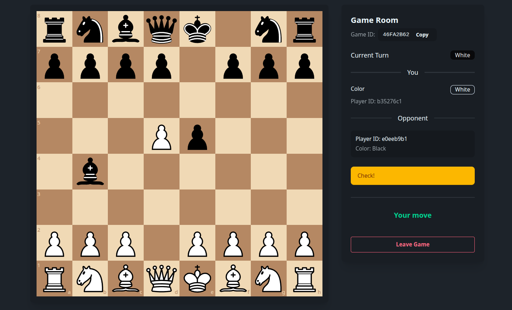

# Chess
A real-time web chess app where you can create a game and play with a friend instantly. <br />
No sign-up. No accounts. Just create a game, share the `GameID`, and start playing.

---



---

## Features
* Create a new game room
* Join an existing game using a `Game ID`
* Real-time move updates using WebSockets
* Live game status inside the game room:
  * Whose turn it is
  * Check
  * Checkmate
  * Draw
  * Stalemate
* Game creator always plays as **White**
* Automatic board orientation based on player color
* Server health status indicator (green/red dot)

---

## 🛠 Tech Stack
### Backend

* **Node.js**
* **TypeScript**
* **WebSockets (`ws`)**
* **`chess.js`** (game logic & rules)

### Frontend

* **Next.js**
* **`react-chessboard`**
* **TailwindCSS + `DaisyUI`**

---

## Project Structure

```
client/
│
├── app/
│   ├── game/page.tsx
│   └── page.tsx
│
├── components/
│   ├── chessBoard.tsx
│   ├── OpponentJoinNotifier.tsx
│   └── ui/
│       ├── gameControls.tsx
│       └── gameStatus.tsx
│
├── context/
│   ├── gameContext.tsx
│   └── notificationContext.tsx
│
├── lib/
│   └── socket.ts
│
└── types/
    └── index.ts
```

```
server/
│
└── src/
    ├── game/
    │   ├── chessEngine.ts
    │   └── gameManager.ts
    │
    ├── server.ts
    ├── index.ts
    │
    ├── types/
    │   └── index.ts
    │
    └── utils/
        └── idGenerator.ts
```

---

## 🧠 How It Works (High Level)
* A user creates a game → server generates a unique Game ID.
* The creator is automatically assigned **White**.
* A second player joins using the same Game ID.
* The server manages game state in memory.
* All moves are validated using `chess.js`.
* The updated state is broadcast to both players in real time.
* Game state includes:
  * FEN
  * Turn
  * Check / Checkmate
  * Draw / Stalemate
  * Player assignments

---

## 📌 Notes
* Game state is stored in-memory (no `Database`).
* A room exists as long as at least one player is connected.
* If both players leave, the room is cleared.
---